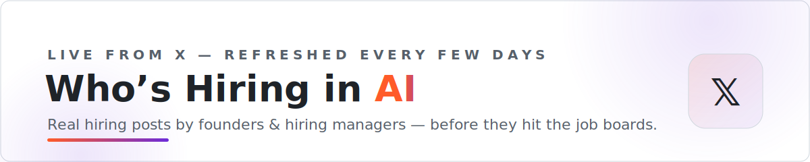

<picture>
  <source media="(prefers-color-scheme: dark)" srcset="assets/banner-dark.svg">
  
</picture>

   

**Real hiring posts by real people — founders, hiring managers and recruiters posting on X**, sorted by role.
Jobs surface here *before* they hit the job boards, and a reply or DM beats a cold application every time.

*Hand-curated, refreshed every few days by [Landed](https://landed.jobs).*

[🔥 Fresh](#fresh) · [🤖 AI / ML / Research](#ai-ml) · [📊 Data](#data) · [🤝 Forward-deployed & Solutions](#fde) · [💻 Software & Infra](#swe) · [🚀 GTM & Growth](#gtm) · [🎨 Product & Design](#product) · [🏢 Multiple / company-wide](#company) · [🧩 Other roles](#other) · [🧵 Roundups & curators](#hiring_roundup) · [🎓 Fellowships & programs](#talent_program)

---

> **Why this exists** — the best AI jobs increasingly get filled from a single post on X: the founder posts, fifty people reply, someone gets hired, and the role never reaches LinkedIn. We bookmark these as we scout roles for [Landed](https://landed.jobs) users and publish the curation here, sorted by role. ⭐ **Star this repo** — it refreshes every 2–3 days.

## Jump to

- [🔥 Freshest 12](#fresh)
- [🤖 AI / ML / Research](#ai-ml) · **5**
- [📊 Data](#data) · **3**
- [🤝 Forward-deployed & Solutions](#fde) · **6**
- [💻 Software & Infra](#swe) · **25**
- [🚀 GTM & Growth](#gtm) · **6**
- [🎨 Product & Design](#product) · **8**
- [🏢 Multiple / company-wide](#company) · **9**
- [🧩 Other roles](#other) · **22**
- [🧵 Roundups & curators](#hiring_roundup) · **7**
- [🎓 Fellowships & programs](#talent_program) · **2**

> ➕ **Know a hiring post we're missing?** [Add it in 30 seconds →](https://github.com/landedjobs/whos-hiring-in-ai/issues/new?template=add-hiring-post.yml) · see [CONTRIBUTING](CONTRIBUTING.md)

---

## 🔥 Freshest 12

_The newest posts across every role. Reply-speed matters on X — start here._

| Who's hiring | The post | Go |
|:---:|:---|:---:|
|  <b><a href="https://twitter.com/nextplayso">next play</a></b> @nextplayso · 5.4k followers | (6/30) A few of our favorite under-the-radar roles from fast-growing companies: • @zzwitz from @tryhelium is hiring a chief of staff. • @MarcLaventure from @scalar is hiring engineers. • @GallagherBilly from … ❤️ 18 · 🔁 1 · today |  |
|  <b><a href="https://twitter.com/vivek_kumar">Vivek Kumar</a></b> @vivek_kumar · 1.7k followers | We are expanding the Sound Team at @GoogleDeepMind! 🔊 We are building AI that doesn't just generate sound, but deeply understands and interacts with it. Looking for a Research Scientist to help us push the … ❤️ 48 · 🔁 3 · today |  |
|  <b><a href="https://twitter.com/lyzr__ai">Lyzr AI</a></b> @lyzr__ai · 438 followers | A year ago we were a much smaller team. Today we are shipping agents into production faster than we can hire for it. That is a good problem. It also means 20+ open roles across the company, and we are looking … ❤️ 114 · 🔁 3 · today |  |
|  <b><a href="https://twitter.com/thedesignobsess">Varun</a></b> @thedesignobsess · 1.3k followers | We’re looking for designers who want to challenge the status quo. If you’re passionate about pushing boundaries and redefining what "good design" means in the age of AI, join us. Open roles: • Motion Design … ❤️ 197 · 🔁 9 · today |  |
|  <b><a href="https://twitter.com/rachit">Rachit Agarwal</a></b> @rachit · 5.6k followers | hiring: we are hiring in our BD team @sunrise tokens, stocks, commodities, dynamic assets etc etc everything on solana dm me or @Sim_Berglund if you'd like to apply ❤️ 397 · 🔁 9 · today |  |
|  <b><a href="https://twitter.com/Nodeworthy_co">Nodeworthy</a></b> @Nodeworthy_co · 37 followers | PSA: We're still hiring! Current open roles: → Junior Operations Associate (SG / MY) → Full Stack Developer (Remote) → Senior Software Engineer (Singapore) → Smart Contract Developer ❤️ 46 · 🔁 1 · today |   <a href="https://twitter.com/Nodeworthy_co/status/2072247381631136012">+2 more roles</a> |
|  <b><a href="https://twitter.com/adamwdb">Adam WB</a></b> @adamwdb · 1.7k followers | Halo warga, gw mau share bbrp lowongan lgi dari kantor gw edisi summer. visa support bagi yang membutuhkan. Lokasinya sesuai dg job posternya ya (Berlin/Barcelona). ❤️ 1.1k · 🔁 120 · 1d ago |  |
|  <b><a href="https://twitter.com/Rahul1539482">rohool_vaki</a></b> @Rahul1539482 · 1.3k followers | hiring at Temple. 1. Data Science Intern (3–6 months) Looking for: strong Python skills, background in Data Science/AI/Statistics/Biomedical Engineering, good understanding of women's cycle health, and the … ❤️ 51 · 🔁 5 · 1d ago |  |
|  <b><a href="https://twitter.com/lets_dig_deeper">rohan</a></b> @lets_dig_deeper · 4.3k followers | hiring for two roles at @rumik_ai 1. growth intern (2X) skills you need to have - - script writing, shooting and video editing - push out 2 creatives/day - ai-generated films pay - 50K/month in person, delhi … ❤️ 112 · 🔁 6 · 1d ago |  |
|  <b><a href="https://twitter.com/mange_manali">Manali Mango</a></b> @mange_manali · 5.1k followers | I'm #hiring a Director of Product Management for a Remote opportunity. This role isn't just about owning a roadmap. We're looking for someone who has: • 8–12 years of Product Management experience • Built … ❤️ 20 · 🔁 2 · 1d ago |  |
|  <b><a href="https://twitter.com/Rahul1539482">rohool_vaki</a></b> @Rahul1539482 · 1.3k followers | 🚀 Clinikally (YC S22) is Hiring AI Engineering Interns! 🏢 Company: Clinikally (YC S22) 💼 Role: AI Engineering Interns 📍 Location: GURGAON 💰 Stipend: Very Competitive 🎯 PPO Offer What You'll Work On: • Build AI … ❤️ 47 · 🔁 1 · 1d ago |  |
|  <b><a href="https://twitter.com/TheAlexCoppess">Alexander Coppess</a></b> @TheAlexCoppess · 2.6k followers | ＿＿＿＿＿＿＿＿ &#124; We’re also hiring &#124; &#124;＿＿＿＿＿＿＿＿&#124; \ (•◡•) / \ / —— &#124; &#124; &#124;_ &#124;_ Open roles: → Production Engineer, Compute (GPU) → Production Engineer, Network → Network Engineer … ❤️ 98 · 🔁 9 · 1d ago |  |

[⬆ back to top](#top)

---

## 🤖 AI / ML / Research · 5

_AI, ML, research and agent-engineering roles._

| Who's hiring | The post | Go |
|:---:|:---|:---:|
|  <b><a href="https://twitter.com/vivek_kumar">Vivek Kumar</a></b> @vivek_kumar · 1.7k followers | We are expanding the Sound Team at @GoogleDeepMind! 🔊 We are building AI that doesn't just generate sound, but deeply understands and interacts with it. Looking for a Research Scientist to help us push the … ❤️ 48 · 🔁 3 · today |  |
|  <b><a href="https://twitter.com/Rahul1539482">rohool_vaki</a></b> @Rahul1539482 · 1.3k followers | 🚀 Clinikally (YC S22) is Hiring AI Engineering Interns! 🏢 Company: Clinikally (YC S22) 💼 Role: AI Engineering Interns 📍 Location: GURGAON 💰 Stipend: Very Competitive 🎯 PPO Offer What You'll Work On: • Build AI … ❤️ 47 · 🔁 1 · 1d ago |  |
|  <b><a href="https://twitter.com/afahmy_dev">Ahmed Fahmy</a></b> @afahmy_dev · 458 followers | We're hiring a Agent Platform Engineer in On-site • Warsaw! Key skills: Python Where: On-site • Warsaw What you'll do: We're betting one general agent across everything a company runs on beats a stack of … ❤️ 17 · 🔁 0 · 1d ago |  |
|  <b><a href="https://twitter.com/pangram">Pangram</a></b> @pangram · 12.2k followers | Come work with us! Pangram is hiring for a number of technical roles, including Backend and Machine Learning Engineer. Apply here: ❤️ 196 · 🔁 10 · 2d ago |   |
|  <b><a href="https://twitter.com/nazzari">Bella</a></b> @nazzari · 9.6k followers | 3 Founding Engineer roles just opened in the @speedrun portfolio: Cascade [NYC]: AI that predicts where the next major construction project will happen before anyone else knows. Founding Engineer: Hands-on LLM … ❤️ 94 · 🔁 4 · 9d ago |  |

[⬆ back to top](#top)

---

## 📊 Data · 3

_Data engineering, data science and analytics roles._

| Who's hiring | The post | Go |
|:---:|:---|:---:|
|  <b><a href="https://twitter.com/Rahul1539482">rohool_vaki</a></b> @Rahul1539482 · 1.3k followers | hiring at Temple. 1. Data Science Intern (3–6 months) Looking for: strong Python skills, background in Data Science/AI/Statistics/Biomedical Engineering, good understanding of women's cycle health, and the … ❤️ 51 · 🔁 5 · 1d ago |  |
|  <b><a href="https://twitter.com/Ayushishm">Ayush</a></b> @Ayushishm · 392 followers | We’re hiring a Data Engineer/Forward Deployed Engineer at Foresight Labs! 🚀 If you have 3-5 years of experience, elite Python/SQL skills, and want to own critical data migrations in the US Legal Tech space … ❤️ 32 · 🔁 0 · 11d ago |  |
|  <b><a href="https://twitter.com/Rahul1539482">rohool_vaki</a></b> @Rahul1539482 · 1.3k followers | About the job About Us Our growth engine combines Smartlead for outbound, Brevo for marketing automation, Firebase/Mixpanel for product analytics, Stripe for billing, and AI bots on our website. We believe AI … ❤️ 4 · 🔁 1 · 12d ago |  |

[⬆ back to top](#top)

---

## 🤝 Forward-deployed & Solutions · 6

_Forward-deployed, solutions and customer-facing engineering._

| Who's hiring | The post | Go |
|:---:|:---|:---:|
|  <b><a href="https://twitter.com/0xaneri">aneri</a></b> @0xaneri · 26.5k followers | I'm hiring our first Forward Deployed Creatives at @ElevenLabs! Dream role for those with deep agency or in-house production experience, fluent in AI creative tools, and strong client instincts. Work directly … ❤️ 941 · 🔁 36 · 1d ago |  |
|  <b><a href="https://twitter.com/afahmy_dev">Ahmed Fahmy</a></b> @afahmy_dev · 458 followers | We're hiring a Forward Deployed Engineer in multiple locations! We're looking for a Forward Deployed Engineer (FDE) - a product engineer who owns a customer's outcome, not just a slice of the roadmap multiple … ❤️ 102 · 🔁 3 · 2d ago |  |
|  <b><a href="https://twitter.com/MerlinEgalite">Merlin Egalite 🕛</a></b> @MerlinEgalite · 9.1k followers | ＿＿＿＿＿＿ &#124; We’re hiring &#124; &#124;＿＿＿＿＿＿&#124; \ (•◡•) / \ / —— &#124; &#124; &#124;_ &#124;_ Open roles: → Chief of Staff → DeFi Desk - APAC → Events Lead → Head of Security → Senior Protocol Engineer → … ❤️ 428 · 🔁 16 · 6d ago |  |
|  <b><a href="https://twitter.com/jinamcapital">Jinam jain</a></b> @jinamcapital · 1.1k followers | #hiring 💼 Casca is hiring &#124; Forward Deployed Engineer 🔥 ₹1.5Cr–₹2.08Cr ($180–250k) &#124; Full Time AI-native fintech &#124; Building AGI for banking &#124; 1-6+ yrs exp Skills: React &#124; TypeScript … ❤️ 49 · 🔁 2 · 11d ago |   |
|  <b><a href="https://twitter.com/pranav6226">Pranav Mahesh</a></b> @pranav6226 · 181 followers | I’m hiring a Forward deployment Engineer. Remote - India This is a hands-on engineering role, not a pure support or DevOps role. Ideal for someone who likes building, deploying, debugging, and talking to … ❤️ 178 · 🔁 4 · 12d ago |  |
|  <b><a href="https://twitter.com/benjaminshafii">Benjamin Shafii</a></b> @benjaminshafii · 2.6k followers | openwork is hiring heavily atm: - design engineer - forward-deployed engineer - also if you're young technical trying to break into tech we have some things for you here's how it works for each: - design … ❤️ 258 · 🔁 9 · 16d ago |  |

[⬆ back to top](#top)

---

## 💻 Software & Infra · 25

_Software, infrastructure and platform roles._

| Who's hiring | The post | Go |
|:---:|:---|:---:|
|  <b><a href="https://twitter.com/Nodeworthy_co">Nodeworthy</a></b> @Nodeworthy_co · 37 followers | PSA: We're still hiring! Current open roles: → Junior Operations Associate (SG / MY) → Full Stack Developer (Remote) → Senior Software Engineer (Singapore) → Smart Contract Developer ❤️ 46 · 🔁 1 · today |   <a href="https://twitter.com/Nodeworthy_co/status/2072247381631136012">+2 more roles</a> |
|  <b><a href="https://twitter.com/_inception_ai">Inception</a></b> @_inception_ai · 18.2k followers | We're hiring at Inception. Diffusion LLMs generate tokens in parallel, not one at a time, so much of the stack underneath has to be built from scratch. We're looking for people who want to build that. Open … ❤️ 249 · 🔁 11 · 1d ago |  |
|  <b><a href="https://twitter.com/ArjChi">arjun</a></b> @ArjChi · 9.7k followers | We are hiring: - Talent Acquisition - Electrical Engineers - Mechanical Engineers - Prod Engineers - MTS - SWE - People Ops Dm me or apply ❤️ 129 · 🔁 12 · 1d ago |   |
|  <b><a href="https://twitter.com/jaigulati_">Jai Gulati</a></b> @jaigulati_ · 615 followers | we at @fluidstack are hiring for: - Production Engineer - MTS - SWE - Community Engagement Lead - Product Engineer - Product Manager - Strategic Transactions - more message me ASAP if you think you are a fit. ❤️ 157 · 🔁 13 · 1d ago |   |
|  <b><a href="https://twitter.com/ryancarson">Ryan Carson</a></b> @ryancarson · 184.5k followers | We're ready to hire our first engineer at @HelloUntangle. It could be you :) Do you ... 1. Use agents to write, test, deploy, fix and optimize 95%+ of your code? 2. Typically manage 5+ agentic threads … ❤️ 247 · 🔁 10 · 1d ago |  |
|  <b><a href="https://twitter.com/Khosdone">Khos</a></b> @Khosdone · 923 followers | 🚨🚨THIS WENT INSANE. We’ve already hired several incredible people from my last post, and we’re just getting started. I’m looking for an exceptional QA Engineer who loves finding bugs before our customers do … ❤️ 13 · 🔁 4 · 1d ago |  |
|  <b><a href="https://twitter.com/JacksonnCreator">Jackson Stone</a></b> @JacksonnCreator · 79 followers | We're hiring a frontend/software engineer at DittoDub. If you like building fast, polished product UI and can ship clean React/TypeScript work without much hand-holding, DM us with a quick intro and a couple … ❤️ 131 · 🔁 7 · 2d ago |  |
|  <b><a href="https://twitter.com/ajay_2512x">Ajay Bhakar</a></b> @ajay_2512x · 12.4k followers | 🚨 NoScrubs is HIRING 1. Data Generalist ₹17L – ₹23L [Bengaluru] 2.Full Stack Engineer ₹16L – ₹25L [Bengaluru] ❤️ 51 · 🔁 1 · 3d ago |   |
|  <b><a href="https://twitter.com/vchennai2">Vikram</a></b> @vchennai2 · 6.3k followers | We're hiring a founding infra engineer @ArdentAI -You'll own scaling to millions of concurrent sandboxes -In person SF -150-200K, 1-3% equity -Bonus if you're incredible at kubernetes, rust and go Comment/DM … ❤️ 166 · 🔁 10 · 4d ago |  |
|  <b><a href="https://twitter.com/BenoHr80463">HR Beno</a></b> @BenoHr80463 · 32.3k followers | Valta is actively hiring across multiple major departments for 100% remote positions. 📍 Location: Fully Remote Open Positions: • Full-Stack Engineer • Backend API Engineer • DevOps / Infrastructure Engineer • … ❤️ 138 · 🔁 16 · 6d ago |  |
|  <b><a href="https://twitter.com/LeadHerLogic">Lead Her Logic</a></b> @LeadHerLogic · 11.6k followers | HIRING Role: Full Stack Engineer 📍Remote Salary: $2,000/month Experience: 2–5 years Requirements: •Strong experience with React •Hands-on experience with Supabase (Auth, RLS, PostgreSQL) •Experience deploying … ❤️ 81 · 🔁 7 · 7d ago |  |
|  <b><a href="https://twitter.com/HRRonald001">HR Ronald</a></b> @HRRonald001 · 19.3k followers | Full Stack Engineer NEEDED 🚨 📍 Remote 💰 Salary: Competitive Responsibilities: • Build across the entire stack (React/Next.js, Node/Python, Postgres/Mongo) • Own features from idea to deployment with real … ❤️ 115 · 🔁 3 · 7d ago |  |
|  <b><a href="https://twitter.com/Akshaybaghels">Akshay Baghel</a></b> @Akshaybaghels · 168 followers | hiring our first engineer. but read this first. i want someone who wants to build amistly with me. not work for me. amistly is the ai operator that runs marketing and distribution for founders. it's live … ❤️ 268 · 🔁 6 · 8d ago |  |
|  <b><a href="https://twitter.com/Keanaalabre">Keana Alabre</a></b> @Keanaalabre · 938 followers | Looking for exceptional founding engineers in SF. I'm partnering with a YC-backed fintech startup building AI agents that automate commercial lending and underwriting for banks. $180K–$230K base + meaningful … ❤️ 85 · 🔁 4 · 8d ago |  |
|  <b><a href="https://twitter.com/NotionHQ">Notion</a></b> @NotionHQ · 522.1k followers | ＿＿＿＿＿＿ &#124; We’re hiring &#124; &#124;＿＿＿＿＿＿&#124; \ (•◡•) / \ / —— &#124; &#124; &#124;_ &#124;_ Open roles: → AI Applications Engineer → AI Conversation Designer, Customer Support → CX Knowledge Architect … ❤️ 8.1k · 🔁 526 · 8d ago |  |
|  <b><a href="https://twitter.com/mange_manali">Manali Mango</a></b> @mange_manali · 5.1k followers | Two Backend Engineering Openings🎩 1. Senior Software Engineer — Bengaluru 7+ years experience &#124; Up to ₹50 LPA 2. Lead Software Engineer (Backend Heavy) — Mumbai 8+ years experience &#124; ₹60–65 LPA Which … ❤️ 16 · 🔁 0 · 9d ago |  |
|  <b><a href="https://twitter.com/vivianazchen">Viviana Chen</a></b> @vivianazchen · 948 followers | I’m giving out referrals for SWE internships for the next 48 hours. $40/hour • Fully Remote Lunon works with global enterprises across financial services, tech, and more. Comment why you’re a good fit, and … ❤️ 233 · 🔁 9 · 9d ago |  |
|  <b><a href="https://twitter.com/connoratlunon">Connor Hyatt</a></b> @connoratlunon · 1.7k followers | Hiring SWE Interns The late night coders. The hackathon winners. The ones who ship for fun and can't stop building. Come build AI that does what consulting firms charge millions for. $40/hr, remote. Drop your … ❤️ 2.6k · 🔁 87 · 9d ago |  |
|  <b><a href="https://twitter.com/Ubaydah26">Ubaydah A❤️👩🏽‍💻</a></b> @Ubaydah26 · 887 followers | 🚨HIRING: Frontend Developers Infinity Software is hiring talented Frontend Developers to join its remote team. 📍 100% Remote 🕒 Full-Time &#124; Part-Time &#124; Contract 💻 Tech Stack: • React.js • Next.js • … ❤️ 21 · 🔁 1 · 9d ago |  |
|  <b><a href="https://twitter.com/kushal124">Kushal Khandelwal</a></b> @kushal124 · 772 followers | Hiring: Backend / AI Engineer (1–3 years) We're building self-improving storefronts at Brink. Think: • AI agents • Rust + Python • Real-time systems • Distributed infrastructure • Convincing shoppers to buy … ❤️ 211 · 🔁 8 · 11d ago |  |
|  <b><a href="https://twitter.com/DarkoSamuel15">Nii Darko</a></b> @DarkoSamuel15 · 321 followers | Looking for a full-stack dev (Next.js/Django) to help finish a SaaS product before launch. Not sharing details publicly. DM me if interested and I'll explain under NDA. ❤️ 47 · 🔁 1 · 11d ago |  |
|  <b><a href="https://twitter.com/hijunedkhatri">Juned Khatri &#124; Engineer Turned Recruiter 🇮🇳</a></b> @hijunedkhatri · 18.8k followers | working on a senior software engineer role that we'll open up later in the day today. ideal for someone with 7-8 years experience, built b2b products and is now looking to transition into a mix of IC and … ❤️ 28 · 🔁 3 · 12d ago |  |
|  <b><a href="https://twitter.com/maladham">Mo Al Adham</a></b> @maladham · 773 followers | We just opened 10 new roles at @frecfinance. The company is going through an inflection point, and we need to scale the team. Here are the roles we’re hiring for and why I’m excited about each one: Backend … ❤️ 181 · 🔁 8 · 15d ago |  |
|  <b><a href="https://twitter.com/JunaidAckroyd">Junaid Ackroyd</a></b> @JunaidAckroyd · 3.5k followers | Hiring AI engineers. 150-250k base + equity. Comment below with something you've built before and I'll reach out to you if there's a fit! ❤️ 436 · 🔁 11 · 16d ago |  |
|  <b><a href="https://twitter.com/jai_mansukhanii">jai</a></b> @jai_mansukhanii · 3.6k followers | We're hiring in Toronto. @generalmagic_ai is building AI infrastructure that makes insurance brokerages AI native. We're already helping brokerages across Canada and the US make their existing teams more … ❤️ 383 · 🔁 17 · 16d ago |  |

[⬆ back to top](#top)

---

## 🚀 GTM & Growth · 6

_Go-to-market, sales, growth and marketing roles._

| Who's hiring | The post | Go |
|:---:|:---|:---:|
|  <b><a href="https://twitter.com/rachit">Rachit Agarwal</a></b> @rachit · 5.6k followers | hiring: we are hiring in our BD team @sunrise tokens, stocks, commodities, dynamic assets etc etc everything on solana dm me or @Sim_Berglund if you'd like to apply ❤️ 397 · 🔁 9 · today |  |
|  <b><a href="https://twitter.com/NotGoKGreen">Kimi</a></b> @NotGoKGreen · 1.9k followers | I'm hiring 2 people at Sam's List! 🗞️ We're a review based marketplace for vetted financial pros and we're in a really exciting growth moment right now! So I'm bringing on two people to help us move faster: 1 … ❤️ 96 · 🔁 10 · 1d ago |  |
|  <b><a href="https://twitter.com/ajay_2512x">Ajay Bhakar</a></b> @ajay_2512x · 12.4k followers | 🚨 Libra AI is HIRING for various roles &gt; CEO's Office &#124; Bengaluru &#124; Full-time &#124; On-site &gt; Chief of Staff &#124; Bengaluru &#124; Full-time &#124; On-site &gt; Founder's Office Intern … ❤️ 84 · 🔁 3 · 6d ago |  |
|  <b><a href="https://twitter.com/mange_manali">Manali Mango</a></b> @mange_manali · 5.1k followers | Making your Monday a little better. We're hiring across Engineering, Product, Design, and Marketing, with opportunities in Bengaluru, Mumbai, Gurugram, and Remote. If you're looking for your next opportunity … ❤️ 112 · 🔁 5 · 10d ago |  |
|  <b><a href="https://twitter.com/ajay_2512x">Ajay Bhakar</a></b> @ajay_2512x · 12.4k followers | 🚨Peakflo (YC W22) is HIRING ➤ Customer Success Manager Location: Philippines / Remote Salary: $10K–14.5K Experience: 3+ years ➤ Product Manager Intern Location: India / Remote Stipend: ₹3.6–4.8 LPA Experience … ❤️ 41 · 🔁 0 · 10d ago |  |
|  <b><a href="https://twitter.com/kamath_sutra">Sudarshan Kamath</a></b> @kamath_sutra · 21.7k followers | We are hiring at @smallest_AI Role - BFSI Sales Location - BKC, Mumbai Experience - 4-6 years Profile - 3-4 years in BCG/Mckinsey Banking practice with 2 years in Tech/Product Education - Tier 1 preferred but … ❤️ 231 · 🔁 16 · 10d ago |  |

[⬆ back to top](#top)

---

## 🎨 Product & Design · 8

_Product management and design roles._

| Who's hiring | The post | Go |
|:---:|:---|:---:|
|  <b><a href="https://twitter.com/thedesignobsess">Varun</a></b> @thedesignobsess · 1.3k followers | We’re looking for designers who want to challenge the status quo. If you’re passionate about pushing boundaries and redefining what "good design" means in the age of AI, join us. Open roles: • Motion Design … ❤️ 197 · 🔁 9 · today |  |
|  <b><a href="https://twitter.com/mange_manali">Manali Mango</a></b> @mange_manali · 5.1k followers | I'm #hiring a Director of Product Management for a Remote opportunity. This role isn't just about owning a roadmap. We're looking for someone who has: • 8–12 years of Product Management experience • Built … ❤️ 20 · 🔁 2 · 1d ago |  |
|  <b><a href="https://twitter.com/Migma_AI">Migma AI</a></b> @Migma_AI · 729 followers | WEE'RE STILL HIRINGGGG! 🚀 Looking for VIBE CODERS, designers and growth leaders! Follow, comment and DM with your CV! Equity, visa sponsor, and competitive salary! #hiring #startups #vibecoders ❤️ 346 · 🔁 12 · 7d ago |  |
|  <b><a href="https://twitter.com/16vchq">16VC</a></b> @16vchq · 2.6k followers | ＿＿＿＿＿＿ &#124; We’re hiring &#124; &#124;＿＿＿＿＿＿&#124; \ (•◡•) / \ / —— &#124; &#124; &#124;_ &#124;_ Open roles: • Investor • Product Engineer • Community Operations • Chief of Staff We're looking for … ❤️ 169 · 🔁 9 · 7d ago |  |
|  <b><a href="https://twitter.com/thedesignobsess">Varun</a></b> @thedesignobsess · 1.3k followers | We're hiring a web design intern at @SarvamAI . If you notice every pixel that's off before anyone points it out, send your work to design@sarvam.ai ❤️ 325 · 🔁 15 · 9d ago |  |
|  <b><a href="https://twitter.com/alokbishoyi97">Alok Bishoyi</a></b> @alokbishoyi97 · 4.3k followers | looking for recs for a solid motion designer / launch video creator. we have been cooking BTS @EVO__HQ and are keen to find the right talent to showcase our work. days of me having to cook up the videos on my … ❤️ 51 · 🔁 1 · 10d ago |  |
|  <b><a href="https://twitter.com/JunaidAckroyd">Junaid Ackroyd</a></b> @JunaidAckroyd · 3.5k followers | Hiring Designers! $140K – $200K base + equity. You are a good fit for Weave if you are a formidable design engineer. This means you stop at nothing to accomplish your goal. We don't care much about your … ❤️ 266 · 🔁 8 · 14d ago |  |
|  <b><a href="https://twitter.com/sridharfyi">Sridhar A</a></b> @sridharfyi · 3.7k followers | one update on our product engineer role at @16vchq. after receiving interest from candidates across multiple countries, we've decided to keep the role remote-first rather than hybrid. we care more about … ❤️ 334 · 🔁 12 · 24d ago |  |

[⬆ back to top](#top)

---

## 🏢 Multiple / company-wide · 9

_Founders hiring across the whole company — many roles in one post._

| Who's hiring | The post | Go |
|:---:|:---|:---:|
|  <b><a href="https://twitter.com/lyzr__ai">Lyzr AI</a></b> @lyzr__ai · 438 followers | A year ago we were a much smaller team. Today we are shipping agents into production faster than we can hire for it. That is a good problem. It also means 20+ open roles across the company, and we are looking … ❤️ 114 · 🔁 3 · today |  |
|  <b><a href="https://twitter.com/TheAlexCoppess">Alexander Coppess</a></b> @TheAlexCoppess · 2.6k followers | ＿＿＿＿＿＿＿＿ &#124; We’re also hiring &#124; &#124;＿＿＿＿＿＿＿＿&#124; \ (•◡•) / \ / —— &#124; &#124; &#124;_ &#124;_ Open roles: → Production Engineer, Compute (GPU) → Production Engineer, Network → Network Engineer … ❤️ 98 · 🔁 9 · 1d ago |  |
|  <b><a href="https://twitter.com/pydantic">Pydantic</a></b> @pydantic · 19.4k followers | We're hiring! If you want to build tools developers reach for, come build with us. We've got multiple roles across engineering and are investing in Pydantic Logfire, the tool teams use to trace, evaluate, and … ❤️ 108 · 🔁 9 · 2d ago |  |
|  <b><a href="https://twitter.com/jai_mansukhanii">jai</a></b> @jai_mansukhanii · 3.6k followers | We're hiring for a lot of engineering roles at @generalmagic_ai, and if you refer someone we hire, that's $10k in your pocket. A new one we just posted, is for a forward deployed engineer. Every brokerage … ❤️ 187 · 🔁 9 · 6d ago |  |
|  <b><a href="https://twitter.com/mintlify">Mintlify</a></b> @mintlify · 20.1k followers | ＿＿＿＿＿＿ &#124; We’re hiring &#124; &#124;＿＿＿＿＿＿&#124; \ (•◡•) / \ / —— &#124; &#124; &#124;_ &#124;_ Open roles: Marketing: → Product Engineer → Senior Product Engineer → Product Marketing Manager → Field … ❤️ 499 · 🔁 20 · 7d ago |  |
|  <b><a href="https://twitter.com/Migma_AI">Migma AI</a></b> @Migma_AI · 729 followers | WEEE’RE HIRINGGG! 🚀 We’re looking for ambitious people who want to join early, build fast, and help shape the future unicorn. Open roles: - AI Full-Stack Engineer / Vibe Coder - Growth Lead - UI/UX &amp; Brand … ❤️ 576 · 🔁 21 · 9d ago |  |
|  <b><a href="https://twitter.com/sayandedotcom">Sayan De</a></b> @sayandedotcom · 517 followers | My org is hiring ! All Contract &amp; 100% Remote 1. Sales &amp; Marketing Specialist 2. UX/UI &amp; Graphic Designer 3. Agile Digital Project Manager 4. Full Stack Web Developer &amp; AI Automation Engineer … ❤️ 85 · 🔁 2 · 10d ago |  |
|  <b><a href="https://twitter.com/jinamcapital">Jinam jain</a></b> @jinamcapital · 1.1k followers | 🚨 Potpie AI is HIRING 8 Roles Bengaluru Founder’s Office Intern Talent Acquisition Intern Forward-Deployed Engineer DevOps Engineer Site Reliability Engineer Full stack engineer AI Engineer AI Researcher ❤️ 35 · 🔁 3 · 11d ago |   |
|  <b><a href="https://twitter.com/syriansigma">steven</a></b> @syriansigma · 681 followers | WE ARE HIRING 🚨 Engineering - Founding Design Eng. $150K - $250K - Founding Product Eng. $130K - $200K - Founding AI Eng. $130K - $200K - Foreward Deployed Eng. $150K - $250K GTM - Enterprise AEs $110K - $130K … ❤️ 266 · 🔁 4 · 15d ago |  |

[⬆ back to top](#top)

---

## 🧩 Other roles · 22

_Ops, chief-of-staff, content and everything else._

| Who's hiring | The post | Go |
|:---:|:---|:---:|
|  <b><a href="https://twitter.com/adamwdb">Adam WB</a></b> @adamwdb · 1.7k followers | Halo warga, gw mau share bbrp lowongan lgi dari kantor gw edisi summer. visa support bagi yang membutuhkan. Lokasinya sesuai dg job posternya ya (Berlin/Barcelona). ❤️ 1.1k · 🔁 120 · 1d ago |  |
|  <b><a href="https://twitter.com/lets_dig_deeper">rohan</a></b> @lets_dig_deeper · 4.3k followers | hiring for two roles at @rumik_ai 1. growth intern (2X) skills you need to have - - script writing, shooting and video editing - push out 2 creatives/day - ai-generated films pay - 50K/month in person, delhi … ❤️ 112 · 🔁 6 · 1d ago |  |
|  <b><a href="https://twitter.com/the_thagomizer">Aja Hammerly</a></b> @the_thagomizer · 7.2k followers | Come work with my team! Happy to answer questions about what a day in the life of DevRel looks like. ❤️ 60 · 🔁 2 · 1d ago |  |
|  <b><a href="https://twitter.com/ZargaryanArthur">Arthur Zargaryan</a></b> @ZargaryanArthur · 485 followers | To all of the cracked Creative Directors out there, we're hiring. OTE: $200-300K per year Location: Remote (SF/NYC Timezones) Intensity: Intense $5K - bonus if we hire someone you refer us! ❤️ 64 · 🔁 1 · 1d ago |  |
|  <b><a href="https://twitter.com/omaikasei">mai</a></b> @omaikasei · 2.4k followers | Adding more gnomes to the @netbackyard We’re building a new asset class at the intersection of compute, finance, and AI, and demand is already setting our hair on fire If you’re obsessed with data centers … ❤️ 116 · 🔁 10 · 2d ago |  |
|  <b><a href="https://twitter.com/ericciarla">Eric Ciarla (hiring)</a></b> @ericciarla · 16.8k followers | we're hiring ❤️ 267 · 🔁 7 · 2d ago |  |
|  <b><a href="https://twitter.com/sojoodi">sojoodi</a></b> @sojoodi · 1.2k followers | Did I mention that we are HIRING!? 👉👉 ❤️ 56 · 🔁 2 · 2d ago |   |
|  <b><a href="https://twitter.com/AnkitaxPriya">anks</a></b> @AnkitaxPriya · 3.4k followers | hiring v actively. if you’ve ever been called “too proactive” we’d like to have a chat :) ❤️ 144 · 🔁 6 · 6d ago |  |
|  <b><a href="https://twitter.com/ninklefitz">Nicole Fitzgerald</a></b> @ninklefitz · 3.2k followers | we are hiring for a small number of high impact roles across research, engineering, and strategic ops at @tacitlabsco! come do the best work of your life with the best people you'll ever work with. we work … ❤️ 179 · 🔁 10 · 6d ago |  |
|  <b><a href="https://twitter.com/RileNFTs">RILE</a></b> @RileNFTs · 15.5k followers | As I promised - I'm hiring everyone. Yes, everyone. No bs job applications, no hiring process, no experience needed. To start - join our Discord where you'll find all the info you need in detail, link is in my … ❤️ 183 · 🔁 13 · 6d ago |  |
|  <b><a href="https://twitter.com/jaigulati_">Jai Gulati</a></b> @jaigulati_ · 615 followers | if you want to make a difference on the frontier of AI, now's your chance! we're hiring, hmu ASAP if you see something you like ❤️ 117 · 🔁 4 · 7d ago |   |
|  <b><a href="https://twitter.com/CommandCodeAI">Command Code</a></b> @CommandCodeAI · 10.1k followers | ＿＿＿＿＿＿ &#124; We’re hiring &#124; &#124;＿＿＿＿＿＿&#124; \ [• v •] / \ / —— &#124; &#124; &#124;_ &#124;_ Open roles in the bio. ❤️ 945 · 🔁 44 · 8d ago |  |
|  <b><a href="https://twitter.com/RO22PER">Emily Carter</a></b> @RO22PER · 2.9k followers | 📢 Dear Applicants, Our recruitment process is still open! To help us review your application faster, please follow these steps carefully: 1️⃣ Visit the Careers section on our website, choose a position that … ❤️ 273 · 🔁 31 · 8d ago |  |
|  <b><a href="https://twitter.com/safishamsii">Safi</a></b> @safishamsii · 3.9k followers | I’m looking for a community ambassador at my yc company @graphifyy. This is mainly about organizing hackathons and doing some devrel to help grow our developer community. Ideally someone with a solid following … ❤️ 48 · 🔁 2 · 8d ago |  |
|  <b><a href="https://twitter.com/Bhoomiarora_">Bhoomi Arora</a></b> @Bhoomiarora_ · 375 followers | hiring the first person on our team. surreal max. community, events &amp; content. 3 months internship, blr. we're building a community growth studio: helping brands scale through community. you'll work with … ❤️ 55 · 🔁 2 · 9d ago |  |
|  <b><a href="https://twitter.com/KjHardrict">KJ Hardrict</a></b> @KjHardrict · 1.5k followers | looking for people who are familiar with automating workflows with AI to pay around $10k/month for less than 20 hours of work per/week. must be US-based. if you're interested, please submit a video of your … ❤️ 47 · 🔁 1 · 9d ago |  |
|  <b><a href="https://twitter.com/ericciarla">Eric Ciarla (hiring)</a></b> @ericciarla · 16.8k followers | we're hiring ❤️ 413 · 🔁 11 · 9d ago |  |
|  <b><a href="https://twitter.com/Rahul1539482">rohool_vaki</a></b> @Rahul1539482 · 1.3k followers | Founder’s Office Intern (AI Native) Company: Stealth Consumer Apps Startup Role: Founder’s Office Intern (AI Native) Location: Remote (1 meeting/week in Gurgaon) Duration: 1–3 Months (Extendable) Stipend … ❤️ 19 · 🔁 1 · 10d ago |  |
|  <b><a href="https://twitter.com/Divyetweets">Divye Agarwal</a></b> @Divyetweets · 1.9k followers | We're hiring for two roles at @binge_labs . -10 Clippers You've heard the word. You've probably even done it. Clipping content from long videos and podcasts into short, engaging pieces. Most college students … ❤️ 51 · 🔁 1 · 10d ago |  |
|  <b><a href="https://twitter.com/msuiche">msuiche</a></b> @msuiche · 1.5k followers | We are hiring btw, email me at matt 0x40 tolmo 0x2e com if you wanna come build and work on cool stuff at @TolmoHQ ❤️ 59 · 🔁 3 · 11d ago |  |
|  <b><a href="https://twitter.com/MeganRisdal">meg.ai 🇨🇦</a></b> @MeganRisdal · 12.4k followers | We're hiring FDEs! Be part of building, shaping, and defining the frontier of AI -- the heart of which is novel, economically valuable evals -- with strategic customers. :) ❤️ 239 · 🔁 14 · 13d ago |   |
|  <b><a href="https://twitter.com/noahliu__">Noah Liu</a></b> @noahliu__ · 572 followers | hiring: someone to run our X account. part-time. $10K/month. I don't care about hours. I care about results. you need to: → actually live on the internet, not just post on it → be deep in AI news (not … ❤️ 591 · 🔁 16 · 15d ago |  |

[⬆ back to top](#top)

---

## 🧵 Roundups & curators · 7

_Accounts that regularly compile who's hiring — worth following at the source._

| Who's hiring | The post | Go |
|:---:|:---|:---:|
|  <b><a href="https://twitter.com/nextplayso">next play</a></b> @nextplayso · 5.4k followers | (6/30) A few of our favorite under-the-radar roles from fast-growing companies: • @zzwitz from @tryhelium is hiring a chief of staff. • @MarcLaventure from @scalar is hiring engineers. • @GallagherBilly from … ❤️ 18 · 🔁 1 · today |  |
|  <b><a href="https://twitter.com/nextplayso">next play</a></b> @nextplayso · 5.4k followers | A few startups now hiring with $10-$50m raised (1/3): • @juno_tax - AI tax preparation (Remote) • @YuzuHealthInc - custom health plans (NYC) • @patlytics - AI patent lifecycle automation (NYC) • @tryoffdeal  … ❤️ 85 · 🔁 4 · 1d ago |  |
|  <b><a href="https://twitter.com/robynxpark">robyn park</a></b> @robynxpark · 1.2k followers | new month, new jobs. design roles at @designerfund companies: ❤️ 170 · 🔁 12 · 1d ago |  |
|  <b><a href="https://twitter.com/hiiinternet">seb</a></b> @hiiinternet · 7.9k followers | ＿＿＿＿＿＿ &#124; I’m hiring &#124; &#124;＿＿＿＿＿＿&#124; \ [• v •] / \ / —— &#124; &#124; &#124;_ &#124;_ Product &amp; ai engineers at startups 120+ startups, 173 interview requests sent this week, 6 offers … ❤️ 199 · 🔁 12 · 6d ago |  |
|  <b><a href="https://twitter.com/MoummarNawafleh">Moummar</a></b> @MoummarNawafleh · 3.1k followers | we’re hiring 50 engineers in the next 2 weeks AI engineers ML researchers Founding product engineers Designer Engineers FDEs These are across seed-series B startups we’re working with backed by investors like … ❤️ 1.1k · 🔁 41 · 9d ago |  |
|  <b><a href="https://twitter.com/katiekirsch">Katie Kirsch</a></b> @katiekirsch · 9.8k followers | .@databricks is hiring for 750+ roles right now! A few open roles that stand out, between $229K - $374K... - Chief of Staff to the CPO (up to $322K) - Product Designer, AI Products (up to $229K) - Head of AI … ❤️ 574 · 🔁 21 · 9d ago |  |
|  <b><a href="https://twitter.com/Keanaalabre">Keana Alabre</a></b> @Keanaalabre · 938 followers | Engineers in SF: Show me what you’ve shipped. A product, side project, agent, anything you’re proud of. I’m hiring across YC backed and VC backed startups right now, with compensation ranging from $150K to … ❤️ 106 · 🔁 0 · 10d ago |  |

[⬆ back to top](#top)

---

## 🎓 Fellowships & programs · 2

_Fellowships, residencies and structured programs announced on X._

| Who's hiring | The post | Go |
|:---:|:---|:---:|
|  <b><a href="https://twitter.com/Austen">Austen Allred</a></b> @Austen · 472.5k followers | Are you a software engineer? Gauntlet AI wants to: - Fly you to Austin - Train you to be on the cutting edge of AI engineering - Cover food, laundry, even clean your room - Help connect you with AI-first jobs … ❤️ 158 · 🔁 12 · 9d ago |  |

<b>🗄️ 1 older fellowships & programs posts</b> (roles may be filled — the accounts stay worth following)

| Who's hiring | The post | Go |
|:---:|:---|:---:|
|  <b><a href="https://twitter.com/MilksandMatcha">Sarah Chieng</a></b> @MilksandMatcha · 24.6k followers | If you are trying to hire a growth engineer, technical GTM, DevRel, (whatever you want to call it) talent.... we have a 'fellowship' of them. Let me know. ❤️ 132 · 🔁 4 · 7mo ago |  |

[⬆ back to top](#top)

---

## How this list is built

An agent reads our team's curated X bookmarks every 2–3 days, keeps only genuine hiring posts (no engagement bait, no "drop your portfolio" farming), sorts them by role, and rebuilds this page. Older posts fall into each section's collapsible archive — the accounts stay worth following even after a role is filled.

**Want in?** [Submit a hiring post](https://github.com/landedjobs/whos-hiring-in-ai/issues/new?template=add-hiring-post.yml) or open a PR editing `data/posts.json`. See [CONTRIBUTING.md](CONTRIBUTING.md).

## How to actually convert these into interviews

Replying "interested!" alongside 200 other people is still spraying. What works: a same-day reply with one concrete, relevant thing you've built, then a short DM referencing the post. Fewer, better applications beat the spray — [Landed](https://landed.jobs) brings you matched roles daily, drafts your answers to each application's questions, and preps you with courses and voice mock interviews.

**[Get started free → https://landed.jobs](https://landed.jobs)**

## Related

- 🧭 [awesome-ai-native-jobs](https://github.com/landedjobs/awesome-ai-native-jobs) — the umbrella for the whole family
- 🚀 [ai-engineer-jobs](https://github.com/landedjobs/ai-engineer-jobs) — 300 live AI engineer roles, auto-updated
- 💸 [recently-funded-ai-startups-hiring](https://github.com/landedjobs/recently-funded-ai-startups-hiring) — fresh-capital companies that are hiring

93 posts from 76 accounts · updated 2026-07-02 · maintained by <a href="https://landed.jobs">Landed</a>. All posts belong to their authors — we link, we don't copy. Not affiliated with X.

